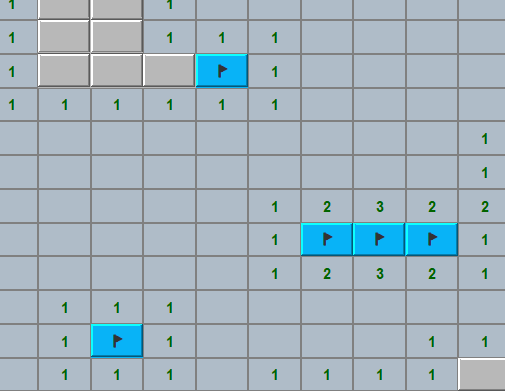
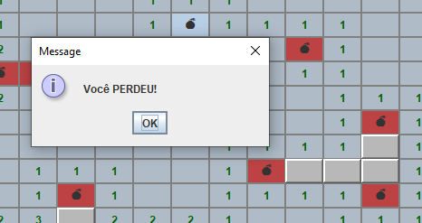
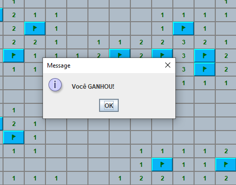

# Jogo Campo Minado - Java (Usando JFrame e AWT)

Este projeto é uma recriação do clássico jogo "Campo Minado" implementado em Java utilizando `JFrame` e `Java AWT`. O jogo apresenta uma interface gráfica interativa, onde o jogador precisa descobrir as células sem detonar minas ocultas.

## Funcionalidades
- **Interface Gráfica**: O jogo usa `JFrame` do Java para a interface gráfica e `AWT` para componentes como botões e rótulos.
- **Posicionamento de Minas**: Colocação aleatória de minas.
- **Estados das Células**: Células não reveladas, reveladas e marcadas.
- **Condição de Vitória**: O jogador vence ao abrir todas as células que não têm minas, marcando todas que tenham.
- **Condição de Perda**: O jogador perde se abrir uma célula contendo uma mina.

## Pré-requisitos
Para rodar este projeto localmente, você precisará:
- **Java Development Kit (JDK)** versão 8 ou superior.
- Uma IDE Java ou editor de texto (por exemplo, IntelliJ IDEA, Eclipse ou Visual Studio Code).

## Controles do Jogo

- **Clique Esquerdo**: Abrir uma célula.
- **Clique Direito**: Marcar uma célula como mina suspeita.

O tamanho da grade do jogo e a contagem de minas podem ser ajustados no código para tornar o jogo mais fácil ou mais desafiador.

## Estrutura de Arquivos
```
CampoMinado/
├── ms/    #arquivos do projeto
│   ├── model/
│   │   ├── Campo.java
│   │   ├── CampoEvent.java
│   │   ├── CampoObserver.java
│   │   ├── ResultadoEvent.java
│   │   └── Tabuleiro.java
│   └── vision/
│       ├── CampoBotao.java
│       ├── MainFrame.java
│       └── TabuleiroPanel.java
├── assets/    #assets para a página no github
│   ├── game.png
│   ├── loses.png
│   └── wins.png
└── README.md
```

## Capturas de Tela

*Exemplo do jogo Campo Minado em ação.*



*Exemplo de derrota no jogo.*



*Exemplo de vitória no jogo.*



###### **made with <3 by me.**